# GUÍA TÉCNICA DE SISTEMA ELECTRÓNICO
## DAMSPI-150 — Descascaradora de Arroz Modular Semiautomática con Pesaje Integrado
### Proyecto Aplicado de Ingeniería 2017275 — Universidad Nacional de Colombia — Grupo B — 1er Semestre 2026

---

## OBJETIVO GENERAL

Definir, especificar e integrar todos los componentes electrónicos, eléctricos y de control del sistema DAMSPI-150, de manera que el equipo de diseño cuente con una guía técnica detallada, clara y verificable para la adquisición, montaje, programación y validación del subsistema electrónico completo.

---

## OBJETIVOS ESPECÍFICOS

- Describir la arquitectura electrónica completa del sistema, identificando los tres niveles: potencia eléctrica, adquisición de señal y control lógico.
- Especificar técnicamente cada componente electrónico requerido: microcontrolador, módulos de conversión, actuadores, sensores e interfaz de usuario.
- Documentar el diagrama de bloques del sistema de control y el diagrama del sistema de potencia eléctrica.
- Establecer las conexiones eléctricas entre los módulos del sistema de control y los actuadores y sensores.
- Definir los requerimientos de firmware del PIC18F4550 para la gestión del ciclo de pesaje y control del embrague.
- Proveer la lista de materiales electrónicos con referencias comerciales y especificaciones de adquisición.

---

## 1. DEFINICIÓN DEL PROBLEMA ELECTRÓNICO

El sistema DAMSPI-150 opera en campo abierto (zona rural de Neiva, Huila) **sin acceso a la red eléctrica**. La totalidad de la energía eléctrica del sistema electrónico y de control debe ser generada de forma autónoma a partir del motor de gasolina de 6.5 HP ya adquirido. Esto implica un doble problema de ingeniería electrónica:

1. **Generación y acondicionamiento de energía eléctrica**: El motor mecánico debe alimentar un sistema eléctrico que incluye un embrague electromagnético de 24 VDC y un sistema de control lógico de 5 V, con autonomía mínima de 4 horas continuas.

2. **Control automático del pesaje**: El sistema debe medir en tiempo real la masa del arroz procesado que cae sobre una plataforma de pesaje, y actuar sobre el embrague electromagnético y la válvula de la tolva al alcanzar el peso objetivo configurado por el operario (10 kg, 25 kg o 50 kg).

El sistema electrónico se integra en el **Módulo 3 — Control, Pesaje e Interfaz**, con la excepción del sistema de potencia eléctrica que pertenece al **Módulo 1 — Potencia**.

---

## 2. ARQUITECTURA GENERAL DEL SISTEMA ELECTRÓNICO

El sistema electrónico se divide en **tres capas funcionales** interconectadas:

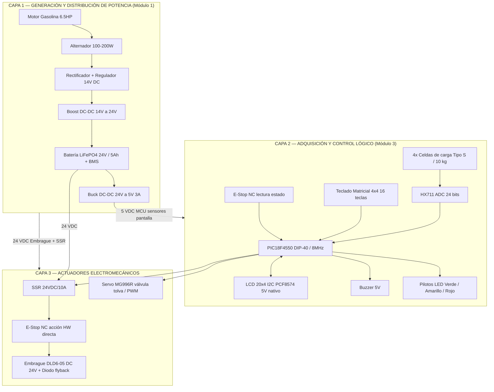

> **Ventaja clave del nuevo diseño**: Al reemplazar la Nokia 5110 (3.3 V) por el LCD 20×4 I2C y los 4 botones por un teclado matricial 4×4, **todo el sistema de control opera a 5 V nativo**. Se elimina el regulador de 3.3 V, los divisores de nivel resistivos y se libera el bus SPI para uso exclusivo del HX711.

---

## 3. SISTEMA DE POTENCIA ELÉCTRICA (MÓDULO 1)

### 3.1 Diagrama de Flujo de Energía

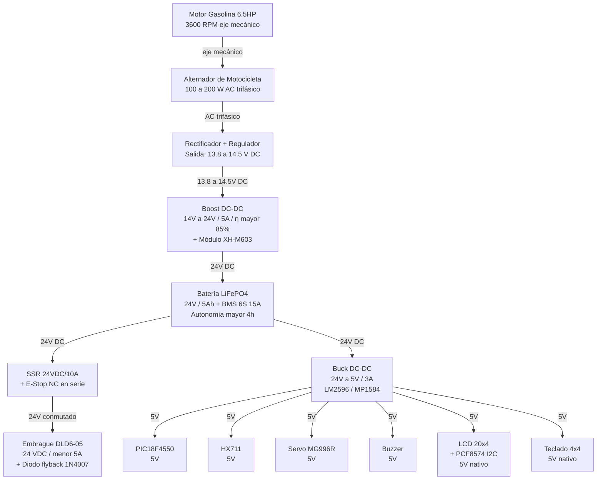

### 3.2 Componentes del Sistema de Potencia Eléctrica

| N° | Componente | Especificación Técnica | Función |
|----|-----------|------------------------|---------|
| 1 | Alternador de motocicleta | 100–200 W, AC trifásico, 3000–5000 RPM | Generación de energía eléctrica desde el eje del motor |
| 2 | Rectificador + regulador de moto | Puente de diodos 15 A + regulador. Salida: 13.8–14.5 V DC | Conversión AC→DC y regulación |
| 3 | Convertidor DC-DC Boost | Entrada: 13.8–14.5 V / Salida: 24 V, 5 A, η ≥ 85% | Elevar tensión para carga de batería 24 V |
| 4 | Batería LiFePO4 | 24 V / 5 Ah, BMS integrado, I_desc_max = 10 A | Fuente centralizada de energía 24 V |
| 5 | Convertidor DC-DC Buck | LM2596 o MP1584. Entrada: 24 V / Salida: 5 V, 3 A | Alimentar MCU, sensores, pantalla, servomotor y buzzer |
| 6 | Módulo de carga XH-M603 | Control de carga para baterías de litio | Protección de la batería LiFePO4 durante la carga |
| 7 | BMS 6S 15A 24V | Protección batería: sobretemperatura, sobrecorriente | Integrado o externo a la batería |

> **Nota de diseño**: El motor de combustión y el alternador deben ubicarse en posición **lateral** respecto al área de procesamiento de arroz, con el escape del motor dirigido al exterior.

---

## 4. MANUFACTURA ADITIVA Y OPTIMIZACIÓN TOPOLÓGICA

### 4.1 Estrategia de Diseño

La mayoría de las piezas estructurales que no están sujetas a cargas de impacto elevado (carcasas, soportes, guías, montajes de sensores, tapas del panel de control) se fabricarán mediante **manufactura aditiva FDM**. El proceso de diseño sigue esta secuencia:

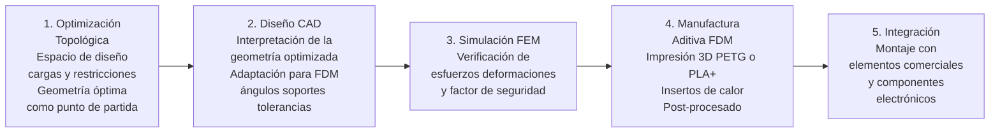

### 4.2 Secuencia de Diseño — Del Subsistema de Salida a la Base

El diseño sigue la secuencia **desde los elementos de mayor complejidad funcional hacia la base de la máquina**, de modo que cada componente ascendente ya tiene definidas sus restricciones geométricas:

| Paso | Subsistema | Componentes impresos clave | Material |
|------|-----------|---------------------------|----------|
| 1 | Tolva de salida + válvula servo | Guía de flujo, soporte MG996R | PETG |
| 2 | Plataforma de pesaje | Soporte celdas tipo S, guías laterales | PLA+ |
| 3 | Panel de control (Módulo 3) | Carcasa con ventana LCD + teclado | PLA+ / PETG |
| 4 | Soporte del embrague y transmisión | Protector embrague, canaleta de cables | PETG |
| 5 | Estructura del chasis y base | Tapas laterales, canaletas, pies | PLA+ |

### 4.3 Parámetros de Manufactura Aditiva

| Parámetro | Valor |
|-----------|-------|
| Tecnología | FDM (filamento fundido) |
| Material estructural | PETG (Tg ≈ 80°C, mayor resistencia química) |
| Material carcasas | PLA+ |
| Relleno piezas estructurales | 40–60%, patrón gyroid |
| Relleno carcasas | 20–30%, patrón cuadrícula |
| Capas perimetrales | ≥ 4 |
| Insertos roscados | Insertos de calor M3 y M4 (knurled heat insert) |
| Tolerancia ensambles | ±0.3 mm en partes deslizantes |

### 4.4 Integración de Sensores y Finales de Carrera en el CAD

Los sensores y elementos de seguridad se consideran **desde la fase de optimización topológica**, no como añadidos posteriores:

- **Celdas de carga tipo S**: los agujeros de montaje M6 son restricciones fijas en la optimización topológica del soporte de plataforma.
- **Servomotor MG996R**: el soporte incluye la geometría del brazo de palanca integrada al cuerpo impreso.
- **Finales de carrera** (si se incorporan): hendiduras de alojamiento con prensacables definidas antes de la geometría final.
- **Rutas de cableado**: modeladas como restricciones de "zona libre de material" en la optimización, garantizando el paso de cables sin interferencias.
- **Módulo PCF8574 + LCD**: la ventana de la carcasa del panel de control se define con las dimensiones exactas del módulo LCD 20×4 y el teclado 4×4 como restricciones de diseño.

---

## 5. MICROCONTROLADOR — PIC18F4550

### 5.1 Especificaciones

| Parámetro | Valor |
|-----------|-------|
| Fabricante | Microchip Technology Inc. |
| Arquitectura | RISC 8 bits, Harvard |
| Memoria Flash | 32 KB |
| RAM | 2 KB |
| EEPROM | 256 bytes |
| Frecuencia máxima | 48 MHz (USB) / 40 MHz (general) |
| Oscilador interno | 8 MHz ajustable |
| Entradas ADC | 13 canales, 10 bits |
| Comunicaciones | USART, MSSP (SPI + **I2C**), USB 2.0 Full Speed |
| Timers | Timer0 (8/16 bit), Timer1, Timer2, Timer3 |
| PWM | CCP1 (RC2), CCP2 (RC1) |
| Pines I/O | 35 pines digitales (Puertos A, B, C, D, E) |
| Encapsulado | DIP-40 |
| Tensión de operación | 2.0 V – 5.5 V |
| Referencia Datasheet | DS39632E — Microchip (2009) |

### 5.2 Asignación de Pines — LCD I2C + Teclado 4×4

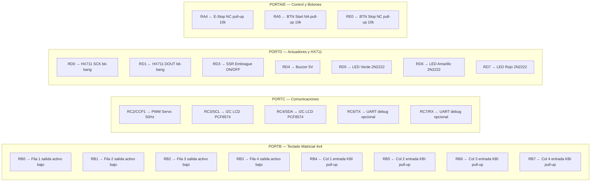

### 5.3 Configuración del Oscilador y Defines

```c
#pragma config FOSC   = INTOSCIO_EC  // Oscilador interno 8 MHz
#pragma config WDT    = OFF
#pragma config PWRT   = ON
#pragma config MCLRE  = ON
#pragma config LVP    = OFF
#pragma config PBADEN = OFF          // PORTB digital al reset
#pragma config BOR    = OFF

#define _XTAL_FREQ   8000000UL
#define LCD_ADDR     0x27            // Dirección I2C PCF8574
#define HX_SCK       RD0
#define HX_DOUT      RD1
#define SSR_PIN      RD3
#define SERVO_PIN    RC2             // CCP1 PWM hardware
#define BUZZER_PIN   RD4
#define ESTOP_PIN    RA4             // E-Stop NC (LOW = presionado)
#define START_PIN    RA5
#define STOP_PIN     RE0
```

---

## 6. SISTEMA DE PESAJE — CELDAS DE CARGA Y HX711

### 6.1 Celdas de Carga Tipo S (×4)

| Parámetro | Valor |
|-----------|-------|
| Capacidad nominal | 10 kg por celda |
| Capacidad total (4 en puente) | 40 kg (rango útil: 0–60 kg) |
| Señal de salida | 2 mV/V nominal |
| Excitación | 5–10 VDC |
| Protección | IP67 |
| Conexión | 4 hilos (Exc+, Exc-, Out+, Out-) |
| Error de linealidad | < 0.05% del fondo de escala |

#### 6.1.1 Configuración en Puente de Wheatstone Completo

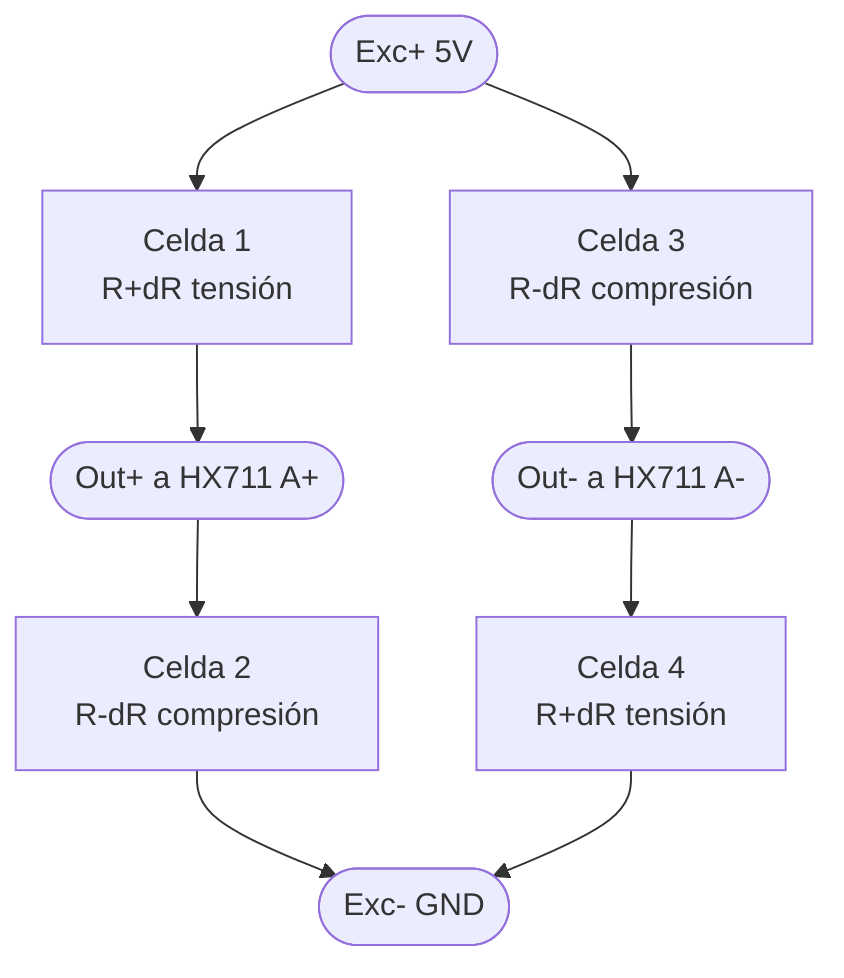

> V_out_max = 5V × 2 mV/V × 2 = **20 mV diferencial** → amplificado por HX711 con ganancia ×128 → 2.56 V al ADC de 24 bits.

### 6.2 Módulo HX711

| Parámetro | Valor |
|-----------|-------|
| Resolución | 24 bits |
| Ganancia canal A | 128× (25 pulsos SCK) |
| Tasa de muestreo | 80 SPS (pin RATE a VCC) |
| Tensión de alimentación | 5 V |
| CMRR | Mín. 100 dB |
| Interfaz MCU | 2 pines: DOUT + SCK (bit-bang) |

---

## 7. INTERFAZ DE USUARIO — LCD 20×4 I2C Y TECLADO MATRICIAL

### 7.1 Pantalla LCD 20×4 con Módulo I2C PCF8574

| Parámetro | Valor |
|-----------|-------|
| Resolución | 20 caracteres × 4 filas |
| Controlador LCD | HD44780 o compatible |
| Módulo adaptador | PCF8574 (expansor I2C de 8 bits) |
| Interfaz con PIC | I2C — solo **2 pines**: RC3 (SCL) y RC4 (SDA) |
| Velocidad I2C | 100 kHz (Standard) / 400 kHz (Fast) |
| **Tensión lógica** | **5 V nativo — sin adaptadores de nivel** |
| Dirección I2C | 0x27 (A2=A1=A0=VCC) o 0x3F según módulo |
| Retroiluminación | LED, controlada por bit P3 del PCF8574 |
| Precio aproximado | $25.000 COP |

#### 7.1.1 Conexión LCD 20×4 I2C con PIC18F4550

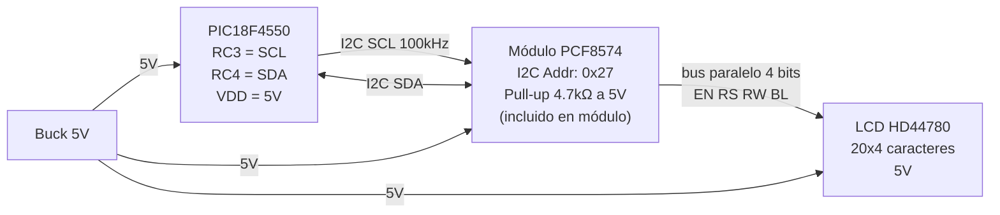

#### 7.1.2 Distribución de la Pantalla LCD 20×4

```
Posicion: 01234567890123456789  (20 columnas)
         ┌────────────────────┐
F1:      │DAMSPI-150 [OPERANDO│  Nombre + Estado actual
F2:      │PESO:   050.000 kg  │  Peso con 3 decimales
F3:      │OBJ:50.0  BLTS: 003 │  Objetivo + contador bultos
F4:      │BAT:███░░ 65% ERR:0 │  Batería estimada + errores
         └────────────────────┘

Estados mostrados en F1:
  [INICIO  ] → Inicializando / tara
  [ESPERA  ] → Listo, embrague libre
  [OPERANDO] → Embrague acoplado, llenando
  [COMPLETO] → Peso objetivo alcanzado
  [  MENU  ] → Navegando configuración
  [E-STOP!!] → Emergencia activa

Pantalla MENU (F1-F4):
  ┌────────────────────┐
  │>>> MENU CONFIG     │
  │> Peso objetivo: 50 │
  │  Tara manual       │
  │  Calibrar sistema  │
  └────────────────────┘
```

### 7.2 Teclado Matricial 4×4

| Parámetro | Valor |
|-----------|-------|
| Tipo | Membrana flexible 4 filas × 4 columnas |
| Teclas | 16 (0–9, A, B, C, D, *, #) |
| Tensión | 3–5 V (compatible directo con PIC a 5 V) |
| Conexión | 8 pines → PORTB completo |
| Precio aproximado | $15.000 COP |

#### 7.2.1 Mapeo de Teclas para DAMSPI-150

```
       COL1(RB4)   COL2(RB5)   COL3(RB6)   COL4(RB7)
F1(RB0): [ 1 ]      [ 2 ]       [ 3 ]      [A = START ]
F2(RB1): [ 4 ]      [ 5 ]       [ 6 ]      [B = STOP  ]
F3(RB2): [ 7 ]      [ 8 ]       [ 9 ]      [C = MENU  ]
F4(RB3): [* = TARA] [ 0 ]       [# = DEL ] [D = OK    ]
```

| Tecla | Función |
|-------|---------|
| `0`–`9` | Entrada numérica del peso objetivo |
| `A` | START — Iniciar ciclo de llenado |
| `B` | STOP — Detener ciclo manualmente |
| `C` | MENU — Acceder al menú de configuración |
| `D` | OK — Confirmar selección |
| `*` | TARA — Ejecutar tara manual |
| `#` | DELETE — Borrar último dígito ingresado |

#### 7.2.2 Algoritmo de Escaneo del Teclado

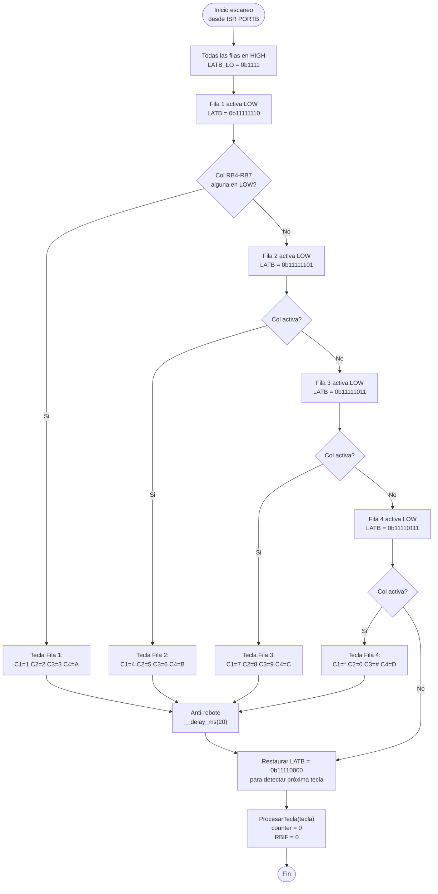

### 7.3 E-Stop y Botones Industriales

| Elemento | Tipo | Pin PIC | Lógica |
|----------|------|---------|--------|
| E-Stop hongo Ø40mm | NC enclavado 10A 24VDC | RA4 (lectura) | LOW = presionado |
| BTN START verde Ø22mm | NA 5A IP65 | RA5 | LOW = presionado |
| BTN STOP rojo Ø22mm | NC 5A IP65 | RE0 | LOW = presionado |

> El E-Stop actúa **directamente en el circuito 24V del SSR** (hardware), independiente del firmware.

---

## 8. ACTUADORES ELECTROMECÁNICOS

### 8.1 Embrague Electromagnético DLD6-05 Tipo A

| Parámetro | Valor |
|-----------|-------|
| Tensión | 24 VDC |
| Corriente | < 5 A nominal ~3–4 A |
| Par | 6 Nm |
| T. respuesta ON | < 0.3 s |
| T. respuesta OFF | < 0.2 s |
| Diámetro eje | 19 mm |

#### 8.1.1 Circuito de Control SSR + E-Stop

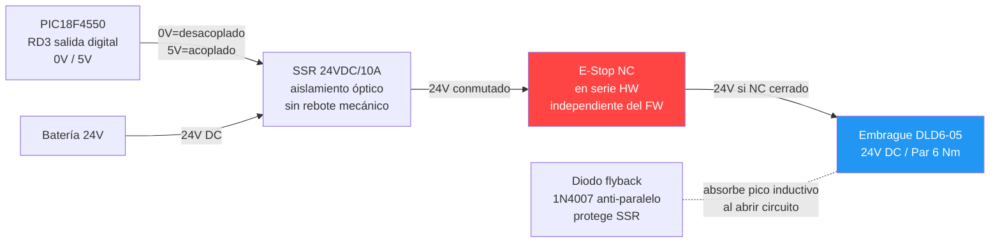

### 8.2 Servomotor MG996R — Válvula de Tolva

| Parámetro | Valor |
|-----------|-------|
| Par | 11 kg·cm @ 6V |
| Señal | PWM T=20 ms pulso 1–2 ms |
| Tensión | 5 V |
| Engranajes | Metálicos (polvo de arroz) |
| Pin PIC | RC2/CCP1 (PWM hardware) |

```c
// PR2 = (8e6 / (4 × 50 × 16)) - 1 = 249
T2CON   = 0b00000011;   // Timer2 ON, prescaler 1:16
PR2     = 249;           // Periodo 20 ms @ 8 MHz
CCP1CON = 0b00001100;   // PWM mode

// Posiciones:
// CERRADA (0°):   CCPR1L = 25   // 1.0 ms / duty 5%
// MEDIA   (90°):  CCPR1L = 37   // 1.5 ms / duty 7.5%
// ABIERTA (180°): CCPR1L = 50   // 2.0 ms / duty 10%
```

---

## 9. INDICADORES DE ESTADO

### 9.1 Pilotos LED 24V (×3) + Buzzer

| Color / Elemento | Estado | Pin PIC | Driver |
|------------------|--------|---------|--------|
| LED Verde | Operando — embrague acoplado | RD5 | 2N2222 + R 1kΩ |
| LED Amarillo | En espera / embrague libre | RD6 | 2N2222 + R 1kΩ |
| LED Rojo | Error / E-Stop / falla batería | RD7 | 2N2222 + R 1kΩ |
| Buzzer 5V | Alertas sonoras | RD4 | R 47Ω directo |

**Alertas sonoras:**
- 1 beep corto (100 ms): confirmación de tecla
- 2 beeps cortos: inicio de ciclo
- 3 beeps largos (500 ms): objetivo alcanzado
- Beep continuo: emergencia activa

---

## 10. DIAGRAMA DE BLOQUES DEL SISTEMA DE CONTROL

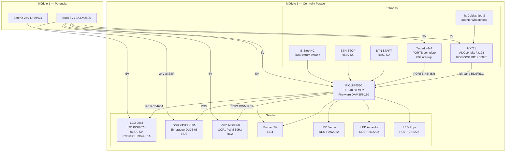

---

## 11. DIAGRAMA DE ESTADOS DEL FIRMWARE

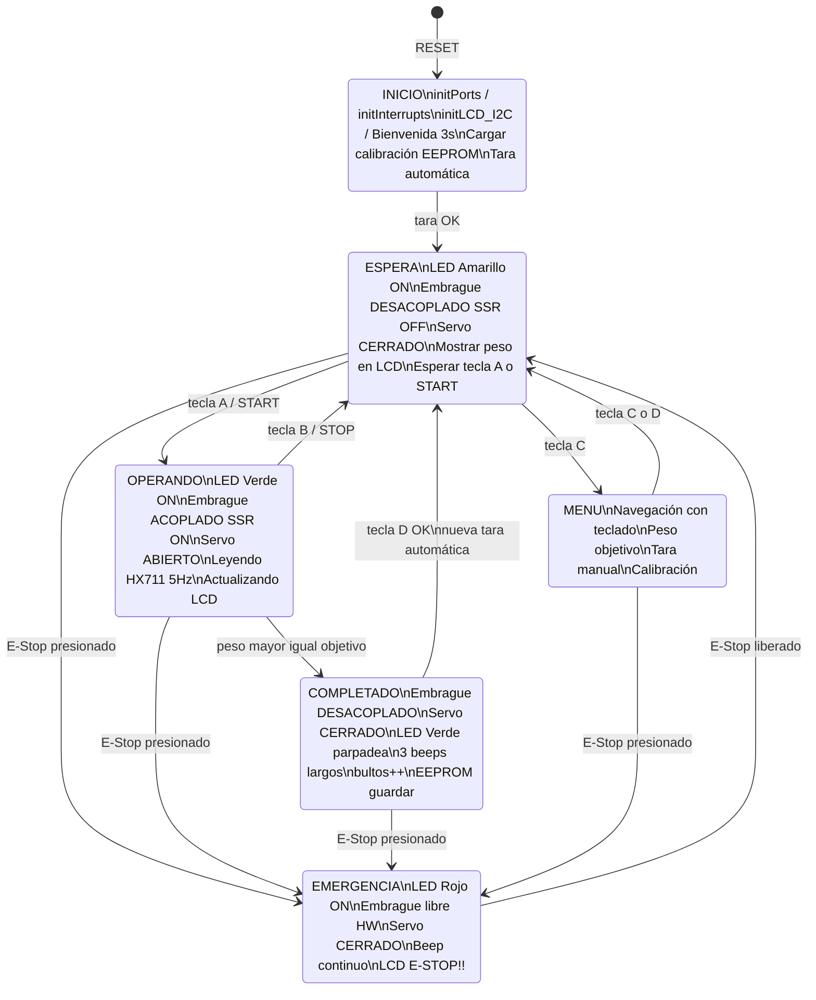

---

## 12. DIAGRAMAS DETALLADOS DEL FIRMWARE

### 12.1 Flujo General — `main()`

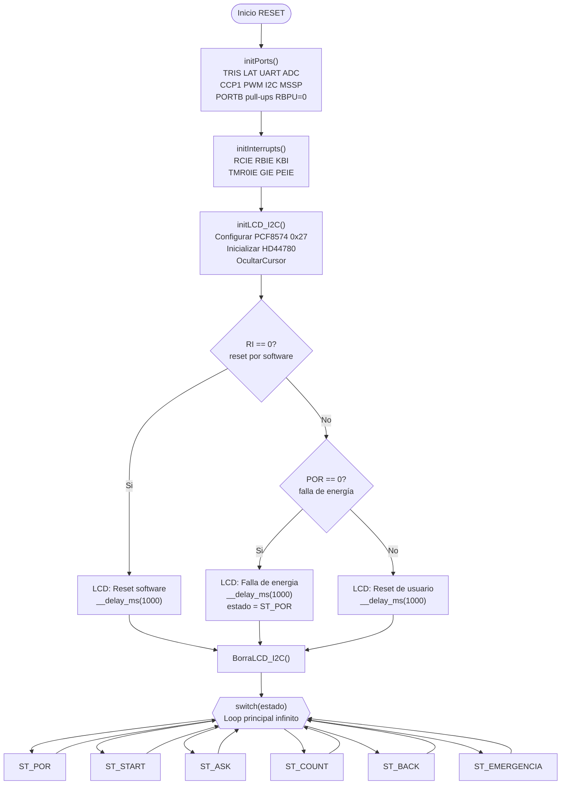

### 12.2 Estado `ST_POR` — Restauración tras Falla de Energía

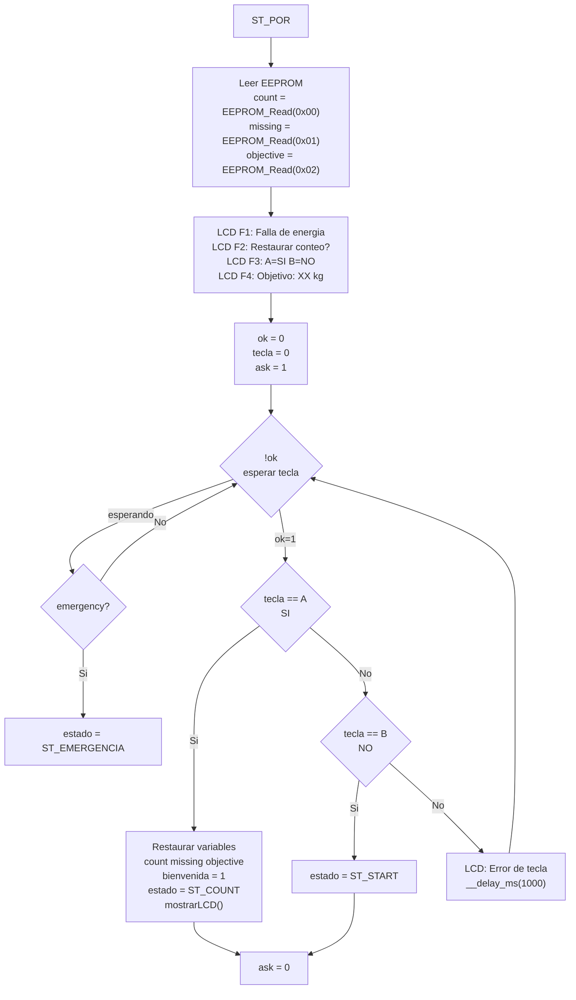

### 12.3 Estado `ST_START` — Bienvenida e Inicialización

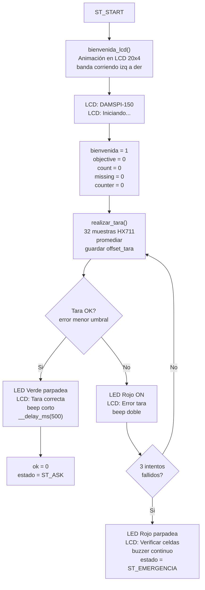

### 12.4 Estado `ST_ASK` — Ingreso del Peso Objetivo

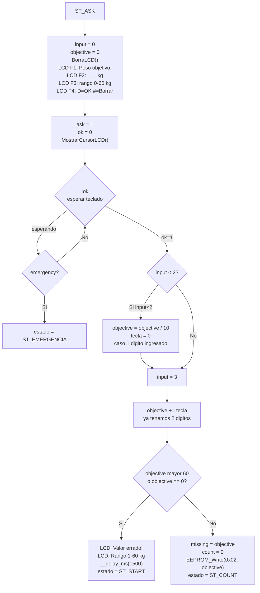

### 12.5 Estado `ST_COUNT` — Ciclo de Pesaje Principal

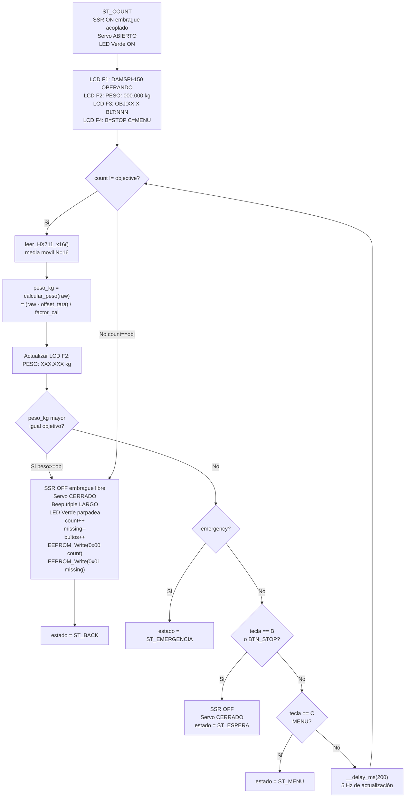

### 12.6 Estado `ST_BACK` — Confirmación de Bulto Completado

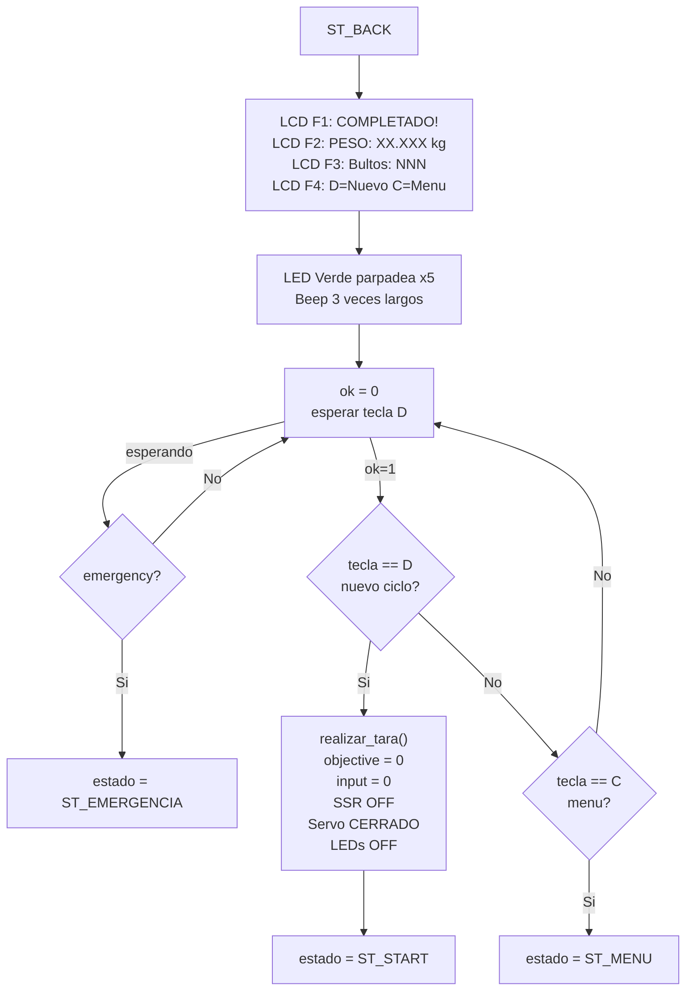

### 12.7 Estado `ST_EMERGENCIA`

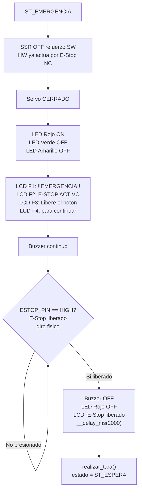

### 12.8 `hx711_leer_raw()` — Lectura 24 bits Bit-Bang SPI

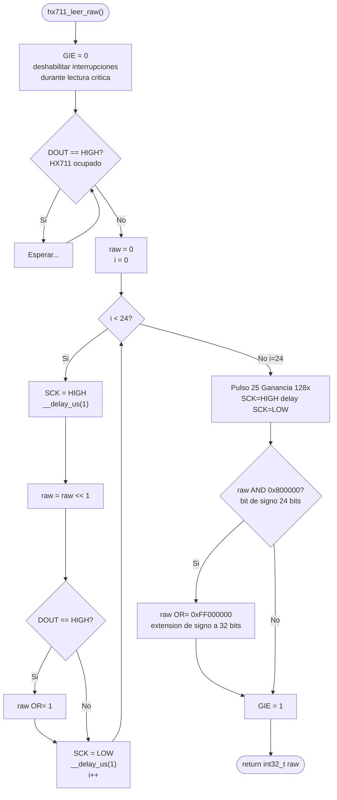

### 12.9 `hx711_leer_promedio()` — Filtro de Media Móvil N=16

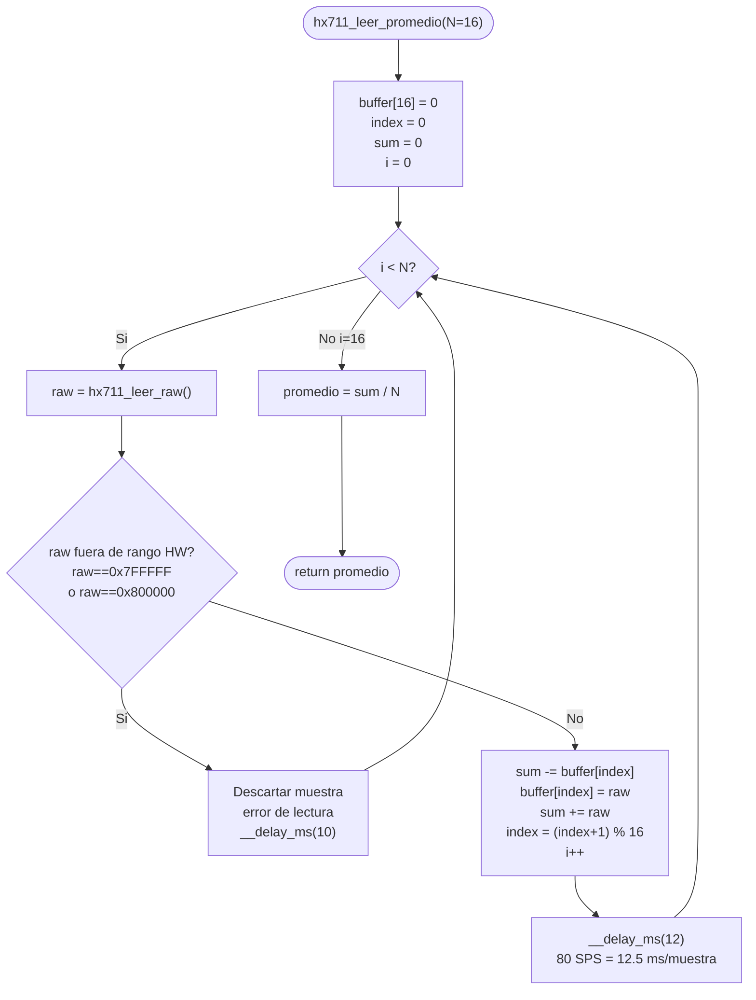

### 12.10 `calcular_peso()` — Aplicar Calibración

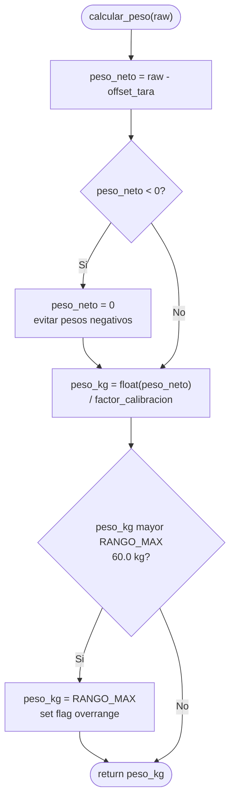

### 12.11 `realizar_tara()` — Calibración de Cero

```mermaid
flowchart TD
    A(["realizar_tara()"])
    B["LCD: Ejecutando tara...\nNo colocar peso"]
    C["32 muestras HX711\nhx711_leer_raw() x32\ndescartar primeras 4"]
    D["offset_tara = promedio(muestras 5-32)"]
    E["EEPROM_Write(ADDR_OFFSET_HI\noffset_tara >> 16)"]
    F["EEPROM_Write(ADDR_OFFSET_MID\n(offset_tara >> 8) AND 0xFF)"]
    G["EEPROM_Write(ADDR_OFFSET_LO\noffset_tara AND 0xFF)"]
    H["LCD: Tara completada\nBeep corto\n__delay_ms(500)"]
    I(["return"])

    A --> B --> C --> D --> E --> F --> G --> H --> I
```

### 12.12 `ISR()` — Rutina de Interrupción Completa

```mermaid
flowchart TD
    A(["__interrupt() ISR"])

    T0{"TMR0IF == 1?\noverflow Timer0\ncada 500 ms"}
    T0A["medioSegundo = !medioSegundo"]
    T0B{"medioSegundo == 1?"}
    T0C["actualizarBateria()\nestimar nivel\npor tensión buck"]
    T0D["counter++"]
    T0E{"counter >= 40?"}
    T0F["LCD_BL = 0 backlight OFF\nSSR = OFF\nSLEEP() ahorro energía"]
    T0G{"counter >= 20?"}
    T0H["LCD_BL = 0\napagar retroiluminación"]
    T0I["TMR0 = 49911\nTMR0IF = 0\nLED_CPU ^= 1"]

    RBIF{"RBIF == 1?\ncambio en PORTB\ntecla presionada"}
    RBIFA{"PORTB != 0b11110000?\ncolumna activa"}
    RBIFB["escaneo_teclado()\nrow scanning 4 filas\nregistrar tecla"]
    RBIFC["ProcesarTecla(tecla)\ncounter = 0"]
    RBIFD["__delay_ms(20)\nanti-rebote\nRBIF = 0"]

    END(["Fin ISR"])

    A --> T0
    T0 -- Si --> T0A --> T0B
    T0B -- Si --> T0C --> T0D
    T0B -- No --> T0D
    T0D --> T0E
    T0E -- Si --> T0F --> T0I
    T0E -- No --> T0G
    T0G -- Si --> T0H --> T0I
    T0G -- No --> T0I

    T0 -- No --> RBIF
    T0I --> RBIF
    RBIF -- Si --> RBIFA
    RBIFA -- Si --> RBIFB --> RBIFC --> RBIFD --> END
    RBIFA -- No --> RBIFD
    RBIF -- No --> END
```

### 12.13 `ProcesarTecla()` — Lógica de Teclas del Teclado 4×4

```mermaid
flowchart TD
    A(["ProcesarTecla(tecla)"])
    NUM{"tecla entre\n0 y 9?"}
    NUMA{"ask == 1\ny input < 2?"}
    NUMB["input++\nobjective = objective*10\n+ valor numerico\nMostrar digito en LCD"]

    TA{"tecla == A\nSTART?"}
    TAA{"estado == ESPERA?"}
    TAB["SSR = ON\nServo = ABIERTO\nestado = ST_COUNT"]

    TB{"tecla == B\nSTOP?"}
    TBA{"estado == ST_COUNT?"}
    TBB["SSR = OFF\nServo = CERRADO\nestado = ST_ESPERA"]

    TC{"tecla == C\nMENU?"}
    TCA["estado = ST_MENU"]

    TD{"tecla == D\nOK?"}
    TDA["ok = 1"]

    TS{"tecla == asterisco\nTARA?"}
    TSA["realizar_tara()"]

    TH{"tecla == numeral\nDELETE?"}
    THA{"input > 0?"}
    THB["input--\nobjective = objective / 10\nBorrar ultimo digito LCD"]

    END(["Fin"])

    A --> NUM
    NUM -- Si --> NUMA
    NUMA -- Si --> NUMB --> END
    NUMA -- No --> END
    NUM -- No --> TA
    TA -- Si --> TAA
    TAA -- Si --> TAB --> END
    TAA -- No --> END
    TA -- No --> TB
    TB -- Si --> TBA
    TBA -- Si --> TBB --> END
    TBA -- No --> END
    TB -- No --> TC
    TC -- Si --> TCA --> END
    TC -- No --> TD
    TD -- Si --> TDA --> END
    TD -- No --> TS
    TS -- Si --> TSA --> END
    TS -- No --> TH
    TH -- Si --> THA
    THA -- Si --> THB --> END
    THA -- No --> END
    TH -- No --> END
```

### 12.14 `EEPROM_Write()` y `EEPROM_Read()`

```mermaid
flowchart LR
    subgraph WRITE["EEPROM_Write(addr, data)"]
        W1["EEADR = addr\nEEDATA = data"]
        W2["EEPGD = 0\nCFGS = 0\nWREN = 1"]
        W3["GIE = 0\ndeshabilitar IRQ\ndurante unlock"]
        W4["EECON2 = 0x55\nEECON2 = 0xAA\nsecuencia unlock"]
        W5["WR = 1\niniciar escritura"]
        W6{"WR == 1?\nen curso"}
        W7["WREN = 0\nGIE = 1"]
        W1 --> W2 --> W3 --> W4 --> W5 --> W6
        W6 -- Si --> W6
        W6 -- No --> W7
    end

    subgraph READ["EEPROM_Read(addr)"]
        R1["EEADR = addr"]
        R2["EEPGD = 0\nCFGS = 0"]
        R3["RD = 1\niniciar lectura"]
        R4(["return EEDATA"])
        R1 --> R2 --> R3 --> R4
    end
```

**Mapa de direcciones EEPROM:**

| Dirección | Variable | Descripción |
|-----------|----------|-------------|
| `0x00` | `count` | Bultos completados en el ciclo actual |
| `0x01` | `missing` | Bultos faltantes |
| `0x02` | `objective` | Peso objetivo (kg entero) |
| `0x03` | `offset_HI` | Byte alto offset de tara |
| `0x04` | `offset_MID` | Byte medio offset de tara |
| `0x05` | `offset_LO` | Byte bajo offset de tara |
| `0x06` | `factor_HI` | Byte alto factor de calibración |
| `0x07` | `factor_LO` | Byte bajo factor de calibración |
| `0x08` | `config_flags` | bit0=idioma, bit1=brillo LCD |

### 12.15 Estructura de Módulos del Firmware

```mermaid
flowchart TD
    MAIN["main.c\ninitPorts\ninitInterrupts\ninitLCD_I2C\nLoop principal\nMaquina de estados"]

    CONFIG["config.h\npragma config\nDefines pines\nDefines constantes\nTipos globales"]

    HX["hx711.c / .h\nhx711_leer_raw\nhx711_leer_promedio\ncalcular_peso\nrealizar_tara"]

    LCD["lcd_i2c.c / .h\ninitLCD_I2C\nMensajeLCD_I2C\nDireccionaLCD_I2C\nBorraLCD_I2C\nEscribeLCD_c\nbacklight ON OFF"]

    KP["teclado.c / .h\nescaneo_teclado\nProcesarTecla\ngetTecla"]

    PESAJE["pesaje.c / .h\nFSM estados\nbienvenida_lcd\nmostrar_peso_lcd\nmostrar_menu_lcd\ngestionar_inactividad"]

    ACTU["actuadores.c / .h\nSSR_ON SSR_OFF\nservo_abrir\nservo_cerrar\nservo_posicion"]

    ALRT["alertas.c / .h\nbeep_corto\nbeep_completado\nbeep_emergencia\nled_estado"]

    EEPROM["eeprom.c / .h\nEEPROM_Write\nEEPROM_Read\nguardar_calibracion\ncargar_calibracion"]

    MAIN --> CONFIG & HX & LCD & KP & PESAJE & ACTU & ALRT & EEPROM
```

---

## 13. LISTA DE MATERIALES ELECTRÓNICOS (BOM v2.0)

### Módulo 3 — Control, Pesaje e Interfaz

| N° | Componente | Cant. | Especificación | Precio Unit. COP | Total COP | Estado | Proveedor |
|----|-----------|-------|---------------|-----------------|-----------|--------|-----------|
| 1 | PIC18F4550 DIP-40 | 1 | 32KB Flash, 8MHz int., I2C, SPI, ADC | $31.000 | $31.000 | Cotizado | AliExpress ítem 1005008943635084 |
| 2 | Celda de carga tipo S 10 kg | 4 | Aluminio, IP67, 2mV/V, 4 hilos | $14.260 | $57.040 | Cotizado | AliExpress ítem 1005008612967612 |
| 3 | Módulo HX711 | 1 | ADC 24 bits, ganancia 128x, 80 SPS | $15.000 | $15.000 | Por adquirir | MercadoLibre |
| 4 | LCD 20x4 + módulo I2C PCF8574 | 1 | HD44780, 5V, I2C 0x27, 20x4 chars | $25.000 | $25.000 | Por adquirir | MercadoLibre / AliExpress |
| 5 | Teclado matricial 4x4 membrana | 1 | 16 teclas, 5V, 8 pines a PORTB | $15.000 | $15.000 | Por adquirir | MercadoLibre / AliExpress |
| 6 | Relé de estado sólido SSR | 1 | DC-DC 24V control, 10A carga | $25.000 | $25.000 | Por adquirir | MercadoLibre Colombia |
| 7 | Servomotor MG996R | 1 | 11 kg·cm, PWM 50Hz, 5V, engranes metálicos | $35.000 | $35.000 | Por adquirir | MercadoLibre / AliExpress |
| 8 | Buck DC-DC 24V→5V 3A | 2 | LM2596 o MP1584 | $12.000 | $24.000 | Por adquirir | MercadoLibre |
| 9 | E-Stop hongo Ø40mm NC | 1 | 10A, 24VDC, rojo, enclavado mecánico | $25.000 | $25.000 | Por adquirir | MercadoLibre / Siesa Industrial |
| 10 | Botón START verde Ø22mm | 1 | NA, 5A, industrial, IP65 | $15.000 | $15.000 | Por adquirir | MercadoLibre |
| 11 | Botón STOP rojo Ø22mm | 1 | NC, 5A, industrial, IP65 | $15.000 | $15.000 | Por adquirir | MercadoLibre |
| 12 | Pilotos LED 24V (x3 colores) | 3 | Ø22mm, cuerpo metálico, 24VDC, IP65 | $12.000 | $36.000 | Por adquirir | MercadoLibre / Siesa |
| 13 | Buzzer activo 5V | 1 | Mayor 80 dB, 5VDC, oscilador interno | $5.000 | $5.000 | Por adquirir | MercadoLibre |
| 14 | Transistor NPN 2N2222 | 5 | 600 mA, 40V, TO-92 | $2.000 | $10.000 | Por adquirir | Electrónicas Bogotá |
| 15 | Diodo 1N4007 | 5 | 1A, 1000V, flyback y protección | $1.000 | $5.000 | Por adquirir | Electrónicas Bogotá |
| 16 | Resistencias 10kΩ 1kΩ 330Ω 47Ω | 1 lote | 1/4W, 5% | $6.000 | $6.000 | Por adquirir | Electrónicas Bogotá |
| 17 | Condensadores 100nF 10µF 100µF | 1 lote | Desacople MCU e I2C | $5.000 | $5.000 | Por adquirir | Electrónicas Bogotá |
| 18 | PCB fabricada o protoboard FR4 | 1 | Montaje circuito de control | $25.000 | $25.000 | Por adquirir | MercadoLibre |
| 19 | Caja de control IP54 | 1 | Con ventana para LCD 20x4 y teclado | $45.000 | $45.000 | Por adquirir | Ferreterías industriales |
| 20 | Conectores JST con latch | 1 lote | Cables entre módulos antivibración | $10.000 | $10.000 | Por adquirir | MercadoLibre |
| | **SUBTOTAL MÓDULO 3** | | | | **$419.040** | | |

> Componentes eliminados vs BOM v1.0: Nokia 5110 (-$15.000), LM1117-3.3 (-$3.000), pulsadores x4 (-$8.000), resistencias divisor nivel (-$2.000). Ahorro: $28.000. Costo adicional: LCD 20x4 (+$25.000), Teclado 4x4 (+$15.000). **Diferencia neta: +$12.000 COP con interfaz muy superior.**

### Módulo 1 — Sistema de Potencia Eléctrica

| N° | Componente | Cant. | Especificación | Precio Unit. COP | Total COP | Estado |
|----|-----------|-------|---------------|-----------------|-----------|--------|
| E1 | Alternador de motocicleta 100–200W | 1 | AC trifásico, 14V rectificado | $180.000 | $180.000 | Por adquirir |
| E2 | Rectificador + regulador 14V | 1 | Puente diodos 15A + regulador moto | $35.000 | $35.000 | Por adquirir |
| E3 | Boost DC-DC 14V→24V 5A | 1 | Eficiencia mayor 85% | $45.000 | $45.000 | Por adquirir |
| E4 | Batería LiFePO4 24V/5Ah + BMS | 1 | BMS integrado, autonomía mayor 4h | $250.000 | $250.000 | Cotizado |
| E5 | Módulo de carga XH-M603 | 1 | Control carga baterías litio | $25.000 | $25.000 | Por adquirir |
| | **SUBTOTAL MÓDULO 1** | | | | **$535.000** | |

> **Total componentes electrónicos**: ~$954.040 COP (dentro del presupuesto global de $7.000.000 COP)

---

## 14. CONSIDERACIONES DE DISEÑO ELÉCTRICO Y EMC

### 14.1 Separación de Masas

```mermaid
flowchart TB
    subgraph POT["GND_POTENCIA"]
        BAT_G["Batería 24V"]
        ALT_G["Alternador"]
        EMB_G["Embrague 24V"]
        SSR_G["SSR carga"]
    end

    subgraph LOG["GND_LÓGICA"]
        BUCK_G["Buck 5V / GND"]
        PIC_G["PIC18F4550"]
        HX_G["HX711"]
        CELLS_G["Celdas de carga Exc-"]
        LCD_G["LCD 20x4 + PCF8574"]
        KP_G["Teclado 4x4"]
    end

    STAR(["PUNTO DE ESTRELLA\nUnico punto de union\nGND_POT con GND_LOG\n+ Ferrita si hay ruido"])

    POT --- STAR
    LOG --- STAR

    WARN["No unir masas\nen multiples puntos\ncrea bucles de tierra\ny acopla ruido al HX711"]
    STAR -.-> WARN
```

### 14.2 Filtrado I2C y Desacople

- Pull-up I2C: **4.7 kΩ a +5V** (generalmente incluidos en el módulo PCF8574).
- Condensador desacople VCC PCF8574: **100 nF cerámico** lo más cerca posible del chip.
- **Longitud máxima cable I2C**: ≤ 30 cm a 100 kHz en este entorno de ruido.
- Si aparecen errores I2C por ruido del alternador: reducir velocidad a **50 kHz** ajustando SSPADD.
- **PCB**: montar sobre standoffs de silicona antivibración dentro de la caja IP54.

---

## 15. PRUEBAS Y VALIDACIÓN

### 15.1 Pruebas de Validación por Subsistema

| ID | Prueba | Procedimiento | Criterio de éxito |
|----|--------|--------------|-------------------|
| P1 | Calibración de pesaje | Masas de 1, 5, 10, 25 y 50 kg | Error < ±100 g en todo el rango |
| P2 | Tara dinámica | Motor encendido, plataforma vacía, 30 min | Deriva < ±300 g en 30 min |
| P3 | Paro automático | Objetivo 5 kg, verter arroz lentamente | SSR OFF al alcanzar 5 kg ±100 g |
| P4 | E-Stop | Presionar durante operación normal | Embrague desacoplado en < 0.5 s |
| P5 | Autonomía batería | Sistema sin motor, batería llena | Operación ≥ 4 horas |
| P6 | Ruido de vibraciones | Motor encendido sin procesar arroz | Fluctuación < ±200 g en lectura |
| P7 | Pantalla LCD I2C | Legibilidad exterior bajo sol | Legible a 1 metro |
| P8 | Teclado matricial | Pulsar cada tecla 10 veces seguidas | Sin fantasmas ni rebotes |
| P9 | Temperatura PCB | 2 horas operación continua | T_PCB < 60°C |
| P10 | Restauración EEPROM | Cortar energía durante ciclo y reiniciar | Ofrece restauración correcta del conteo |

### 15.2 Protocolo de Puesta en Marcha

```mermaid
flowchart TD
    S1["1. Verificar conexiones de potencia\nPolaridad batería\nOrientación SSR\nDiodo flyback embrague"]
    S2["2. Energizar solo el buck 5V\nSin conectar embrague\nVerificar 5.0V ±0.25V en bornes PIC"]
    S3["3. Cargar firmware via ICSP\nPICkit 3 o 4\nVerificar suma de verificación"]
    S4["4. Verificar pantalla LCD I2C\nDebe mostrar: DAMSPI-150\nDirección 0x27 detectada\nRetroiluminación ON"]
    S5["5. Verificar teclado matricial\nProbar cada tecla en modo diagnóstico\nVerificar tecla correcta en LCD"]
    S6["6. Calibrar celdas de carga\nTara con plataforma vacía\nCalibar con masa de referencia conocida"]
    S7["7. Probar E-Stop y SSR\nSin motor con embrague desconectado\nVerificar corte en menos 0.5 s"]
    S8["8. Prueba de ciclo completo\nConectar todo\nCiclo real con masa de referencia"]

    S1 --> S2 --> S3 --> S4 --> S5 --> S6 --> S7 --> S8
```

---

## 16. HERRAMIENTAS DE DESARROLLO

| Herramienta | Uso | Observación |
|-------------|-----|-------------|
| MPLAB X IDE mayor 6.0 | Entorno de desarrollo PIC18F4550 | Gratuito Microchip |
| XC8 Compiler mayor 3.0 | Compilador C para PIC 8 bits | Versión free suficiente |
| PICkit 3 o 4 | Programador/depurador ICSP | 5 pines: MCLR PGD PGC VDD GND |
| Multímetro digital | Verificación tensiones y continuidad | Resolución mV corriente hasta 10 A |
| Osciloscopio | Verificar PWM 50 Hz e I2C 100 kHz | Recomendado para depuración HX711 |
| Analizador lógico | Depurar bus I2C SCL/SDA | Mayor 8 canales 24 MHz muestreo |
| Fuente variable 0-30V 3A | Pruebas sin motor | Para simular batería 24V |
| Masas de calibración certificadas | Calibración del pesaje | 1 kg 5 kg 10 kg de precisión conocida |
| Fusion 360 Generative Design o nTopology | Optimización topológica piezas impresas | — |
| Cura o Bambu Studio | Slicer FDM preparación de impresión | — |

---

## 17. REFERENCIA RÁPIDA DE PARÁMETROS CLAVE

| Parámetro | Valor |
|-----------|-------|
| Microcontrolador | PIC18F4550, DIP-40, 8 MHz interno |
| Pantalla | LCD 20×4 HD44780 + PCF8574 I2C, 5V, dir. 0x27 |
| Teclado | Matricial 4×4 membrana, PORTB, KBI ISR |
| Tensión sistema de control | 5 V DC sin regulador 3.3V |
| Tensión embrague | 24 V DC menos 5 A |
| Tensión batería | 24 V LiFePO4 5 Ah |
| Resolución de pesaje | 24 bits HX711 resolución efectiva ~1 g |
| Rango de pesaje | 0–60 kg |
| Precisión | ±100 g requerimiento / ~±21 g esperado |
| Frecuencia actualización peso | 5 Hz (80 SPS dividido 16 promedio) |
| Frecuencia PWM servo | 50 Hz período 20 ms CCP1 hardware |
| Velocidad I2C LCD | 100 kHz Standard Mode |
| Tiempo respuesta embrague | < 0.5 s SSR + DLD6-05 |
| Autonomía batería | Mayor 4 horas |
| Protección IP caja | Mínimo IP54 |
| Temperatura operación | 10–40°C Neiva Huila |
| Material estructural impreso | PETG infill 40-60% mayor 4 perímetros |
| Material carcasas impresas | PLA+ infill 20-30% |

---

## REFERENCIAS

- Microchip Technology Inc. (2009). *PIC18F4550 Datasheet* (DS39632E). Chandler, AZ, EE.UU.
- AVIA Semiconductor. (2016). *HX711 24-bit ADC for Weigh Scales: Datasheet*. Xiamen, China.
- NXP Semiconductors. (2021). *PCF8574 Remote 8-bit I/O expander for I2C bus* (Rev. 7). Eindhoven, Países Bajos.
- Hitachi. (1998). *HD44780U LCD-II: Dot Matrix LCD Controller/Driver*. Tokio, Japón.
- Ministerio de Trabajo de Colombia. (1979). *Resolución 2400 de 1979: Estatuto de seguridad industrial*. Bogotá, Colombia.
- ISO 11684:1995. *Tractors and machinery for agriculture — Safety signs and hazard pictorials*. Ginebra, Suiza.
- ISO 4254-1:2013. *Agricultural machinery — Safety — Part 1: General requirements*. Ginebra, Suiza.
- Sanchez C., S. D. (2025). *PIC Conveyor — PIC18F4550 — Sistema de banda transportadora* (Repositorio de referencia). Universidad Nacional de Colombia.
- Informe de Avance Parte I — DAMSPI-150 (2026). Grupo B, PAI 2017275, Universidad Nacional de Colombia.

---

*Guía Técnica v2.0 | Abril 2026 | Proyecto PAI 2017275 — Grupo B | Universidad Nacional de Colombia*
*Samuel D. Sanchez C. · Gabriel E. Bojacá M. · Andrés G. Pinilla M. · Nicolás Herreño F. · Santiago Ávila C. · Sebastián D. Millan B.*
