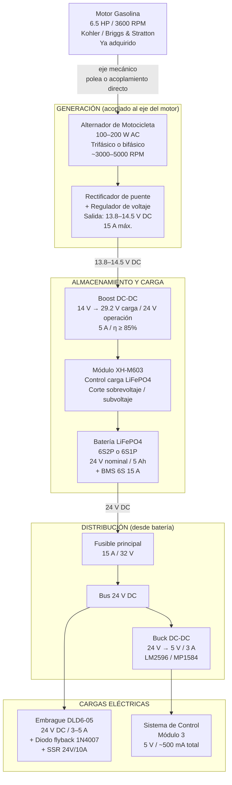
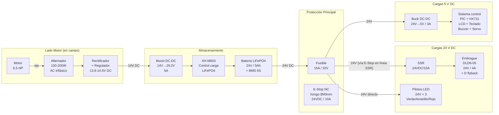
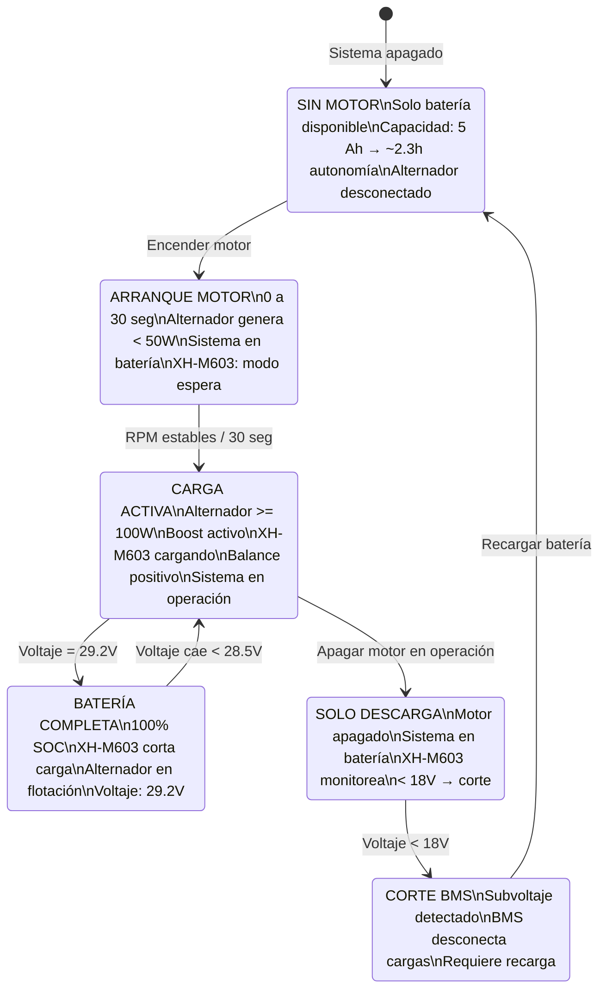

# GUÍA TÉCNICA — SISTEMA ELÉCTRICO DE POTENCIA
## DAMSPI-150 · Módulo 1 — Generación, Almacenamiento y Distribución de Energía
### Responsable: Santiago Ávila C. (diseño y cableado) · Samuel D. Sánchez C. (gestión compras)

---

## 1. ALCANCE DE ESTA GUÍA

Esta guía cubre **exclusivamente el sistema eléctrico de potencia** del DAMSPI-150: la cadena que va desde el motor de gasolina hasta los bornes de salida de 5 V DC y 24 V DC que alimentan el resto de los módulos. La electrónica de control (MCU, sensores, firmware) está documentada en `08_Electronica/GUIA_ELECTRONICA.md`.

**Lo que cubre esta guía:**
- Alternador de motocicleta acoplado al eje del motor
- Rectificación y regulación AC→DC
- Elevación de tensión (Boost DC-DC 14 V → 24 V)
- Batería LiFePO4 24 V / 5 Ah + BMS
- Sistema de carga inteligente (XH-M603)
- Convertidor Buck DC-DC 24 V → 5 V
- Embrague electromagnético DLD6-05 (24 V DC, parte eléctrica)
- Cableado de potencia entre módulos
- Protecciones: fusibles, E-Stop, diodo flyback

**Lo que NO cubre (ver `08_Electronica/GUIA_ELECTRONICA.md`):**
- PIC18F4550 y firmware
- HX711 y celdas de carga
- LCD 20×4 I2C, teclado matricial
- SSR (parte lógica de control)
- Pilotos LED lógicos y buzzer

---

## 2. ESPECIFICACIONES ELÉCTRICAS DEL SISTEMA

| Parámetro | Valor |
|-----------|-------|
| Fuente primaria | Motor gasolina 6.5 HP / 3600 RPM (ya adquirido) |
| Fuente eléctrica | Alternador de motocicleta 100–200 W |
| Tensión bus principal | 24 V DC (batería LiFePO4) |
| Tensión lógica | 5 V DC (buck converter desde 24 V) |
| Corriente máxima embrague | < 5 A @ 24 V |
| Corriente total sistema (peak) | ~8 A @ 24 V |
| Autonomía sin motor | ≥ 4 horas (batería 5 Ah) |
| Temperatura de operación | 10–45 °C (campo abierto Neiva) |
| Protección IP caja eléctrica | Mínimo IP54 |
| Voltaje de carga batería (LiFePO4) | 29.2 V (4.85 V/celda × 6S) |
| Voltaje de corte descarga | 18.0 V (3.0 V/celda × 6S) |

---

## 3. ARQUITECTURA DEL SISTEMA ELÉCTRICO



---

## 4. COMPONENTES DEL SISTEMA ELÉCTRICO

### 4.1 Alternador de Motocicleta

| Parámetro | Valor |
|-----------|-------|
| Tipo | Trifásico o bifásico de imán permanente |
| Potencia nominal | 100–200 W @ velocidad nominal |
| Velocidad de operación | 3000–5000 RPM (acoplado al eje del motor) |
| Tensión AC de salida | 14–18 V AC (sin carga) |
| Tensión DC rectificada | 13.8–14.5 V DC (con regulador) |
| Acoplamiento al motor | Polea conducida Ø80 mm sobre eje secundario, o acoplamiento flexible directo |
| Referencia comercial | Alternador estátor universal de moto 150–200cc (MercadoLibre / repuestos motos) |
| Precio estimado | $180.000 COP |
| Responsable compra | Santiago / Samuel |

> **Criterio de selección**: El alternador debe generar potencia suficiente para cargar la batería mientras el sistema está en operación. Con la batería cargada al 80%, el consumo neto del sistema eléctrico (embrague + control) es de ~175 W. Un alternador de 150 W es suficiente en operación normal; la batería cubre los picos.

> **Acoplamiento mecánico**: Se recomienda usar una polea conducida de Ø80 mm montada sobre el eje secundario de la transmisión del motor, para aprovechar la relación de transmisión y mantener el alternador en su rango óptimo de velocidad. Alternativa: acoplamiento flexible directo al eje del motor.

### 4.2 Rectificador de Puente + Regulador de Voltaje

| Parámetro | Valor |
|-----------|-------|
| Tipo | Rectificador de puente de diodos + regulador IC de motocicleta |
| Corriente máxima | 15 A |
| Tensión de salida | 13.8–14.5 V DC regulada |
| Disipación de calor | Montar sobre perfil de aluminio con pasta térmica |
| Referencia | Regulador rectificador universal de moto (ATV/moto 12V) |
| Precio estimado | $35.000 COP |

> El regulador convencional de motocicleta (tipo shunt) disipa el exceso de potencia como calor. Es robusto y de bajo costo. Para mayor eficiencia se puede usar un MPPT dedicado, pero no es necesario en esta aplicación.

### 4.3 Convertidor Boost DC-DC (14 V → 24 V)

| Parámetro | Valor |
|-----------|-------|
| Topología | Boost (elevador) síncrono |
| Tensión de entrada | 10–16 V DC (rango alternador) |
| Tensión de salida | 24–29.2 V DC ajustable |
| Corriente de salida | 5 A continua |
| Eficiencia | ≥ 85% @ carga nominal |
| Protecciones | Sobrevoltaje, sobrecorriente, temperatura |
| Referencia | Módulo Boost DC-DC XL6009 o LM2587 de alta potencia |
| Precio estimado | $45.000 COP |
| Responsable compra | Samuel |

> **Ajuste**: El potenciómetro del Boost se ajusta para que la tensión de salida sea ~29.2 V cuando el módulo XH-M603 esté en modo carga. En operación con batería ya cargada, el módulo XH-M603 regula y el Boost solo mantiene la tensión flotante.

### 4.4 Módulo de Control de Carga XH-M603

| Parámetro | Valor |
|-----------|-------|
| Función | Controlador de carga inteligente para baterías de litio |
| Tensión máx. de carga (LiFePO4 6S) | 29.2 V |
| Tensión mín. de descarga | 18.0 V (corte automático) |
| Corriente de carga máxima | 10 A (ajustable) |
| Indicador | LED bicolor + display de voltaje |
| Precio estimado | $25.000 COP |

> El XH-M603 protege la batería contra sobrecargas y descarga profunda. Se conecta entre la salida del Boost y la entrada de la batería. Cuando la batería llega a 29.2 V (carga completa), el módulo corta la carga automáticamente.

### 4.5 Batería LiFePO4 24 V / 5 Ah + BMS

| Parámetro | Valor |
|-----------|-------|
| Química | LiFePO4 (Litio Hierro Fosfato) |
| Configuración | 6S1P (6 celdas en serie, 3.2 V nominal c/u) |
| Tensión nominal | 22.2 V (≈ 24 V en uso) |
| Tensión de carga completa | 29.2 V (4.85 V/celda) |
| Tensión de corte | 18.0 V (3.0 V/celda) |
| Capacidad | 5 Ah → 110–120 Wh |
| Corriente de descarga continua | 10 A |
| Corriente de descarga pico | 20 A (< 5 s) |
| BMS integrado | 6S 15 A — protección: sobreVolt, subVolt, sobrecorriente, cortocircuito, sobretemperatura |
| Autonomía del sistema electrónico | > 4 horas @ consumo promedio ~25 W |
| Ciclos de vida | > 2000 ciclos @ 80% DOD |
| Peso | ~1.2 kg |
| Dimensiones aprox. | 145 × 60 × 35 mm |
| Referencia AliExpress | ítem 1005009963240184 |
| Precio estimado | $250.000 COP |
| Responsable compra | Santiago / Samuel |

> **Ventaja LiFePO4 sobre Li-Ion**: Mucho más segura en entornos de campo (sin riesgo de ignición espontánea), mayor estabilidad térmica (Tmax operación = 60°C vs 45°C de Li-Ion), mayor vida útil en ciclos.

> **Cálculo de autonomía**:
> - Embrague DLD6-05: ~4 A × 24 V = 96 W (solo cuando está acoplado; ciclo ~40%)
> - Sistema de control: ~0.5 A × 5 V = 2.5 W (continuo)
> - Pilotos LED 24 V (×3): ~0.3 A × 24 V = 7.2 W (continuo)
> - **Consumo promedio**: ~(96 × 0.4) + 2.5 + 7.2 ≈ **48 W**
> - Autonomía = 110 Wh ÷ 48 W ≈ **2.3 h solo con batería**
> - Con alternador funcionando (≥ 100 W), el balance energético es positivo → autonomía **ilimitada** en operación normal.

### 4.6 Convertidor Buck DC-DC (24 V → 5 V)

| Parámetro | Valor |
|-----------|-------|
| Topología | Buck (reductor) con regulación PWM |
| Tensión de entrada | 8–36 V DC |
| Tensión de salida | 5.0 V DC ± 0.1 V |
| Corriente de salida | 3 A continua |
| Eficiencia | ≥ 85% @ carga nominal |
| CI recomendado | LM2596HVS o MP1584EN |
| Protecciones | Sobrecorriente, sobrevoltaje de salida |
| Cantidad | 2 unidades (una de respaldo) |
| Precio estimado | $12.000 COP c/u |

> Alimenta: PIC18F4550, HX711, LCD 20×4 I2C, teclado 4×4, buzzer, servo MG996R, lógica de señal.

### 4.7 Embrague Electromagnético DLD6-05 Tipo A (parte eléctrica)

| Parámetro | Valor |
|-----------|-------|
| Tensión de operación | 24 VDC ± 10% |
| Corriente nominal | 3–4 A (absorción al energizar: hasta 6 A por 50 ms) |
| Potencia disipada | ~80–100 W |
| Resistencia de bobina | ~5–8 Ω @ 20°C |
| Protección | **Diodo flyback 1N4007 en anti-paralelo** (obligatorio) |
| Control | SSR 24VDC/10A (conmutación desde PIC18F4550) |
| Seguridad | E-Stop NC en serie con la línea de 24 V al SSR |

> **⚠️ CRÍTICO**: Sin el diodo flyback, la apertura del circuito genera un pico de tensión inductiva de hasta 5× la tensión nominal (≈120 V). Este pico destruye el SSR, el BMS y puede dañar la batería. El diodo 1N4007 debe soldarse **directamente** sobre los terminales del embrague, con la polaridad correcta (cátodo al positivo del embrague).

---

## 5. DIAGRAMA UNIFILAR DEL SISTEMA ELÉCTRICO



---

## 6. CABLEADO DE POTENCIA ENTRE MÓDULOS

### 6.1 Secciones de Cable Recomendadas

| Tramo | Corriente Máx. | Sección Recomendada | Tipo |
|-------|---------------|--------------------|----|
| Alternador → Rectificador | 15 A AC | 2.5 mm² (AWG 13) | Cable flexible THHN |
| Rectificador → Boost DC-DC | 10 A DC | 2.5 mm² (AWG 13) | Cable flexible DC |
| Boost → Batería (positivo) | 10 A DC | 2.5 mm² (AWG 13) | Cable flexible DC |
| Batería → Fusible principal | 15 A DC | 4.0 mm² (AWG 11) | Cable rígido DC |
| Bus 24V → SSR (embrague) | 6 A DC | 1.5 mm² (AWG 15) | Cable flexible |
| Bus 24V → Buck DC-DC | 3 A DC | 1.0 mm² (AWG 17) | Cable flexible |
| Bus 24V → Pilotos LED | 1 A DC | 0.75 mm² (AWG 18) | Cable flexible |
| Buck 5V → Módulo control | 3 A DC | 1.0 mm² (AWG 17) | Cable flexible |

> **Norma de colores** (seguir en TODO el proyecto):
> - Rojo / naranja: positivo 24 V DC
> - Amarillo: positivo 14 V DC (pre-Boost)
> - Negro: GND / masa común
> - Verde/amarillo: tierra de seguridad (chasis)
> - Azul: positivo 5 V DC (lógico)

### 6.2 Conectores entre Módulos

Todos los cables entre módulos usarán **conectores industriales con latch** (enclavamiento mecánico) para evitar desconexiones por vibración:

| Circuito | Conector Recomendado | Pines |
|----------|--------------------|----|
| 24 V DC principal (Mod1 → Mod3) | Anderson SB50 rojo | 2 pines (+ y GND) |
| 5 V DC lógico (Mod1 → Mod3) | JST-VH 3.96 mm | 2 pines |
| Señal SSR (Mod3 → embrague) | JST-XH 2.54 mm | 2 pines |
| Cable comunicación pilotos | Molex MX1.25 | 6 pines (3 × GND + señal) |

### 6.3 Protecciones

| Protección | Dispositivo | Dónde |
|-----------|-------------|-------|
| Fusible principal | Fusible automotriz 15 A + portafusible | En positivo salida batería |
| Fusible derivación control | Fusible 3 A | Entrada buck DC-DC |
| Fusible derivación embrague | Fusible 8 A | Línea 24V al SSR |
| Flyback embrague | Diodo 1N4007 en anti-paralelo | Directamente en bornes embrague |
| E-Stop hardware | Pulsador NC Ø40mm 10A/24V | En serie con 24V al SSR |
| BMS batería | BMS 6S 15A integrado | Dentro del pack LiFePO4 |
| Corte por temperatura | Bimetal o sensor NTC en la caja | En la caja de control |

---

## 7. SISTEMA DE CARGA — ESTADOS Y TRANSICIONES



---

## 8. MONTAJE FÍSICO — MÓDULO 1 (POTENCIA)

### 8.1 Disposición de Componentes

El Módulo 1 debe organizarse para maximizar la disipación de calor y minimizar la longitud de cables de alta corriente:

```
┌──────────────────────────────────────────────────┐
│              MÓDULO 1 — CAJA DE POTENCIA          │
│                                                   │
│  [MOTOR 6.5HP]  ═══ eje ═══ [ALTERNADOR]         │
│        │                         │                │
│        │                    [RECTIFICADOR]         │
│        │                    [REGULADOR]            │
│        │                         │  14V DC         │
│        └──────────────────  [BOOST DC-DC]         │
│                                  │  24-29V DC      │
│                             [XH-M603]             │
│                                  │                │
│                         [BATERÍA LiFePO4]         │
│                             + [BMS 6S]            │
│                                  │  24V DC         │
│                         [FUSIBLE PRINCIPAL]       │
│                                  │                │
│              ┌───────────────────┤                │
│              │                   │                │
│         [BUCK 5V]          [SALIDA 24V]           │
│              │  5V DC            │  24V DC         │
│         → Módulo 3          → Mod3 (SSR+EMB)     │
└──────────────────────────────────────────────────┘
```

### 8.2 Consideraciones de Seguridad en el Montaje

1. **Temperatura**: El rectificador y el Boost DC-DC generan calor. Montar sobre disipadores de aluminio con pasta térmica. Prever ventilación pasiva mínima o un pequeño ventilador DC 5V si la caja es cerrada.

2. **Acceso al fusible**: El portafusible principal debe ser accesible sin abrir la caja (montado en pared lateral o con tapa transparente).

3. **Motor y alternador**: Ubicar con escape del motor **alejado** de la zona de arroz procesado. El cable del alternador al rectificador debe ir por canaleta separada de los cables DC.

4. **Batería**: Montar en posición fija con cinta de doble faz + sujetador de velcro. La batería LiFePO4 no requiere ventilación especial (no emite gases en operación normal).

5. **Separación de masas**: La GND del sistema eléctrico (24 V) y la GND del sistema lógico (5 V) se unen en UN SOLO PUNTO (punto de estrella) dentro del Módulo 3. Ver `08_Electronica/GUIA_ELECTRONICA.md §13`.

---

## 9. PRUEBAS DE VALIDACIÓN DEL SISTEMA ELÉCTRICO

| ID | Prueba | Procedimiento | Criterio de éxito |
|----|--------|--------------|-------------------|
| E1 | Tensión de salida alternador | Arrancar motor, medir Vout del rectificador | 13.5–14.8 V DC @ 3600 RPM |
| E2 | Funcionamiento Boost DC-DC | Verificar salida del Boost con motor en marcha | 28.8–29.5 V DC @ carga 3 A |
| E3 | Carga de batería | Dejar cargando 30 min con motor, medir voltaje batería | Incremento > 0.5 V / 15 min |
| E4 | Estabilidad del Buck 5 V | Con sistema en operación, medir V5V con carga y sin carga | 4.9–5.1 V DC bajo cualquier condición |
| E5 | Consumo del embrague | Medir corriente con embrague acoplado | < 5 A @ 24 V DC |
| E6 | Autonomía de batería | Apagar motor, operar solo con batería, medir tiempo hasta corte BMS | ≥ 2 horas de operación |
| E7 | E-Stop hardware | Presionar E-Stop durante operación normal con embrague acoplado | Embrague desacoplado en < 0.5 s |
| E8 | Diodo flyback | Con osciloscopio, medir pico de voltaje al abrir embrague | Pico < 30 V (sin flyback puede llegar a 100 V+) |
| E9 | BMS protección | Desconectar cable positivo de batería en operación | Sin chispa en bornes del BMS |
| E10 | Temperatura 1 hora | Operar 1 hora continua, medir temperatura componentes | T < 70°C en todos los componentes |

---

## 10. LISTA DE MATERIALES — SISTEMA ELÉCTRICO

| N° | Componente | Cant. | Especificación | Precio Unit. COP | Total COP | Estado | Resp. |
|----|-----------|-------|---------------|-----------------|-----------|--------|-------|
| E1 | Alternador de motocicleta | 1 | 100–200 W AC trifásico, 14 V rectificado | $180.000 | $180.000 | 🛒 Por adquirir | Santiago / Samuel |
| E2 | Rectificador + regulador 14 V | 1 | Puente diodos 15 A + regulador moto | $35.000 | $35.000 | 🛒 Por adquirir | Santiago |
| E3 | Boost DC-DC 14 V → 24 V | 1 | 5 A, η ≥ 85%, step-up XL6009 | $45.000 | $45.000 | 🛒 Por adquirir | Samuel |
| E4 | Batería LiFePO4 24 V / 5 Ah | 1 | 6S1P, BMS 6S 15 A integrado | $250.000 | $250.000 | 📋 Cotizado | Santiago / Samuel |
| E5 | Módulo carga XH-M603 | 1 | Control carga baterías litio | $25.000 | $25.000 | 🛒 Por adquirir | Samuel |
| E6 | Buck DC-DC 24 V → 5 V / 3 A | 2 | LM2596 o MP1584 | $12.000 | $24.000 | 🛒 Por adquirir | Samuel |
| E7 | Fusible automotriz 15 A + portafusible | 2 | 32 V, tipo ATO con portafusible | $5.000 | $10.000 | 🛒 Por adquirir | Samuel |
| E8 | Fusible automotriz 8 A + portafusible | 2 | 32 V, protección derivación embrague | $4.000 | $8.000 | 🛒 Por adquirir | Samuel |
| E9 | Fusible automotriz 3 A + portafusible | 2 | 32 V, protección derivación control | $4.000 | $8.000 | 🛒 Por adquirir | Samuel |
| E10 | E-Stop hongo Ø40 mm NC | 1 | 10 A, 24 VDC, rojo, enclavado | $25.000 | $25.000 | 🛒 Por adquirir | Samuel |
| E11 | Conector Anderson SB50 rojo | 2 pares | 50 A, 600 V, par M/H | $18.000 | $36.000 | 🛒 Por adquirir | Samuel |
| E12 | Conectores JST-VH 3.96 mm | 5 pares | 2 pines, 10 A | $3.000 | $15.000 | 🛒 Por adquirir | Samuel |
| E13 | Cable flexible 2.5 mm² rojo (5 m) | 1 | THHN 600 V | $15.000 | $15.000 | 🛒 Por adquirir | Santiago |
| E14 | Cable flexible 2.5 mm² negro (5 m) | 1 | THHN 600 V | $15.000 | $15.000 | 🛒 Por adquirir | Santiago |
| E15 | Cable flexible 1.0 mm² azul (3 m) | 1 | THHN 600 V | $8.000 | $8.000 | 🛒 Por adquirir | Santiago |
| E16 | Diodo 1N4007 (×5) | 5 | 1 A, 1000 V, flyback y protección | $1.000 | $5.000 | 🛒 Por adquirir | Samuel |
| E17 | Disipadores de aluminio | 3 | Para rectificador, Boost y Buck | $5.000 | $15.000 | 🛒 Por adquirir | Santiago |
| E18 | Canaleta plástica 20×10 mm (2 m) | 2 | Para cableado interno módulo 1 | $8.000 | $16.000 | 🛒 Por adquirir | Santiago |
| E19 | Caja de paso IP54 (potencia) | 1 | Para alojar rectificador, boost, buck, módulo carga | $35.000 | $35.000 | 🛒 Por adquirir | Santiago |
| | **SUBTOTAL SISTEMA ELÉCTRICO** | | | | **$535.000** | | |

---

## 11. REFERENCIA RÁPIDA — PARÁMETROS ELÉCTRICOS CLAVE

| Parámetro | Valor |
|-----------|-------|
| Tensión bus principal | 24 V DC (LiFePO4) |
| Tensión lógica | 5 V DC (buck) |
| Tensión de carga batería | 29.2 V (XH-M603) |
| Tensión de corte batería | 18.0 V (BMS) |
| Corriente max. embrague | 5 A @ 24 V |
| Corriente max. sistema control | 0.5 A @ 5 V |
| Corriente max. pilotos LED | 0.3 A @ 24 V |
| Corriente total (peak) | ~8 A @ 24 V |
| Potencia alternador | 100–200 W AC |
| Autonomía (solo batería) | ~2.3 h @ consumo promedio |
| Autonomía (con motor) | Ilimitada (balance positivo) |
| Norma cableado | Colores: rojo=24V, negro=GND, azul=5V |
| Fusible principal | 15 A / 32 V |

---

*Guía Eléctrica v1.0 | Abril 2026 | DAMSPI-150 — PAI 2017275 — Grupo B*
*Responsable: Santiago Ávila C. (diseño eléctrico) | Samuel D. Sánchez C. (compras)*
